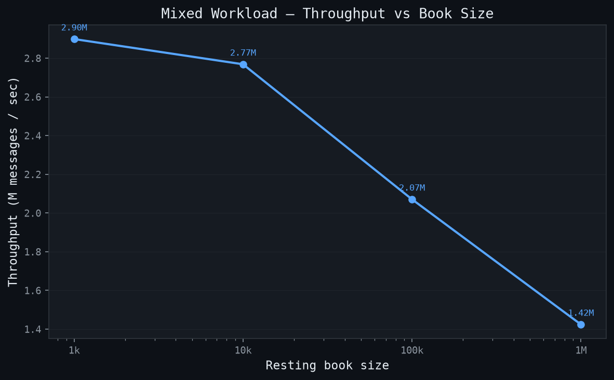
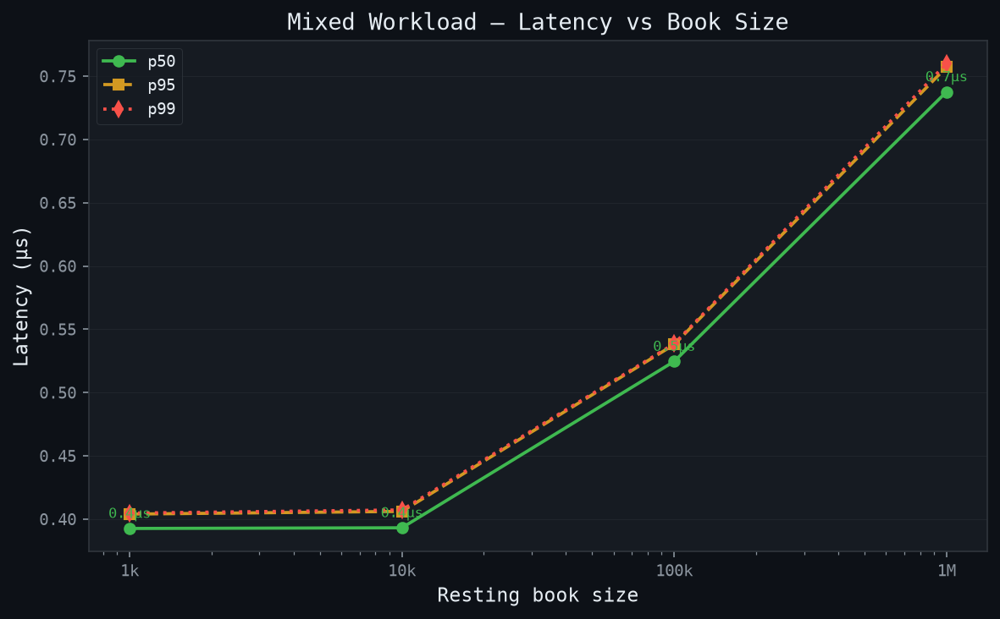
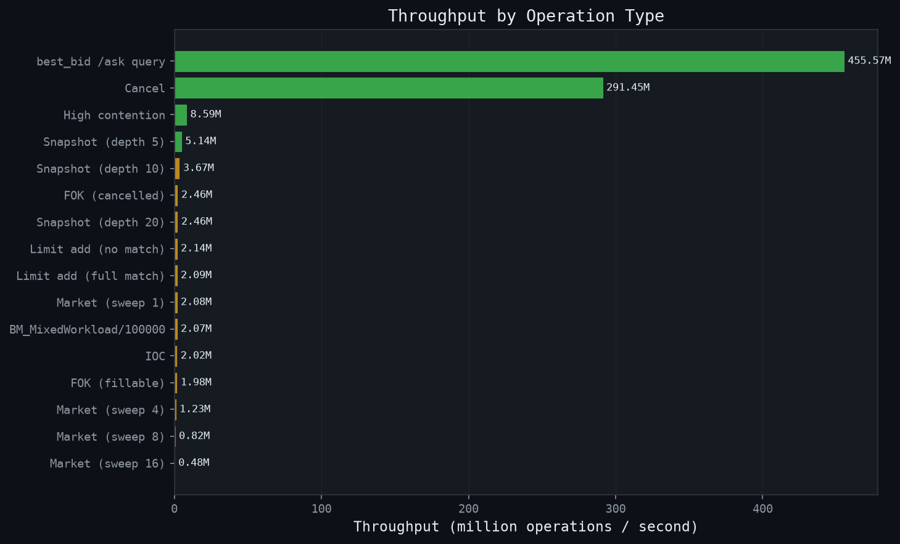
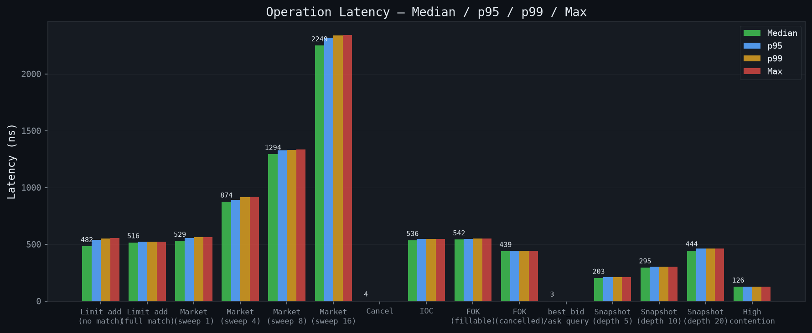

# [Limit Order Book Engine](https://order-book-indol.vercel.app/)
A high-performance, polymorphic limit order book engine written in C++ with a FastAPI backend and React dashboard for interactive simulation.
 
The core engine implements price-time priority FIFO matching against a red-black tree order book (`TreeOrderBook`), with a strategy-pattern architecture that allows book implementations (tree book vs. vector book), price level implementations (linked list price level vs. vector price level) and matching algorithms (FIFO vs Pro Rata) to be swapped independently. 

Live URL: https://order-book-indol.vercel.app/

**Mixed workload · 100k resting orders**
 
| Metric | Value |
|---|---|
| Throughput | 2.07M msgs/s |
| p50 latency | 0.5246 µs |
| p95 latency | 0.5379 µs |
| p99 latency | 0.5386 µs |
| max latency | 0.5387 µs |
| Workload mix | 40% passive limit · 35% cancel · 20% market · 5% IOC |
 
---

## Tech Stack
### Languages & Build


 
### Frameworks & Libraries


 
### Containers & Infra


## Repo Layout
```text
cpp/                        # C++20 engine — compiled as a shared library
  include/order_book/
    core/                   # Fundamental types: Order, Side, OrderType, events, price utils
    book/                   # Abstract OrderBookInterface + TreeOrderBook / VectorOrderBook (post-MVP)
    matching/               # Abstract MatchingAlgorithm + FIFOMatcher / ProRataMatcher (post-MVP)
    orders/                 # StopOrderManager, OrderValidators
    sources/                # OrderSource interface: InteractiveSource, HistoricalReplayer, StrategySource
    engine/                 # SimulationEngine — priority-queue merge of all sources
  src/                      # Implementations corresponding to each header above
  tests/                    # GoogleTest suite (63 tests)
  benchmarks/               # Google Benchmark suite; output consumed by scripts/plot_benchmarks.py
 
python/
  backend/
    app/                    # FastAPI server: REST endpoints + WebSocket book stream
  .venv/
 
frontend/
  src/                      # React + Recharts dashboard (Vite)
 
scripts/
  plot_benchmarks.py        # Reads docs/bench_raw.json → writes figures to docs/bench_figures/
 
docs/
  bench_raw.json            # Raw Google Benchmark JSON output
  bench_figures/            # Generated plots (latency histograms, throughput, CDFs)
  dashboard.png             # Dashboard screenshot
```

---
 
## Architecture
 ```
Order flow
──────────
InteractiveSource ──┐
HistoricalReplayer ──┼──► SimulationEngine ──► OrderBook ──► FillEvent
StrategySource    ──┘          │                               │
                               │◄──────── BookSnapshot ────────┘
                               │
                      StopOrderManager
                      ├── stop_buys_   (std::map ascending)
                      └── stop_sells_  (std::map descending)
 
 
Data structures (TreeOrderBook)
───────────────────────────────
bids_     std::map<int64_t, LinkedListPriceLevel, std::greater>   O(log L) lookup
asks_     std::map<int64_t, LinkedListPriceLevel>                  O(1) best ask
order_map_  std::unordered_map<order_id, {side, price, iterator}>  O(1) cancel
```
 
---
 
## Engine API
 
**Supported order types**
 
| Type | Behaviour |
|---|---|
| `LIMIT` | Rests in book at specified price if not immediately matchable |
| `MARKET` | Fills at any price; remainder cancelled if insufficient liquidity |
| `MARKET_LIMIT` | Like MARKET but unfilled remainder rests at last traded price |
| `STOP` | Triggers as MARKET when last trade price crosses stop price |
| `STOP_LIMIT` | Triggers as LIMIT at `limit_price` when stop price is crossed |
| `IOC` | Immediate-or-cancel: fill what's available, cancel remainder |
| `FOK` | Fill-or-kill: fill entire quantity or cancel without any partial fills |
 
**Key interfaces**
 
```cpp
// Construct with any combination of book implementation + matching algorithm
TreeOrderBook book("AAPL", std::make_unique<FIFOMatcher>(), callbacks);
 
// Core operations — all O(log L) where L = distinct price levels
book.add(order);              // match then rest, or cancel per order type
book.cancel(order_id);        // O(1) hash map lookup + O(1) list erase
book.execute(order_id, qty);  // feed-driven partial/full fill
book.replace(old_id, order);  // atomic cancel + add (new order loses time priority)
 
// O(1) queries
book.best_bid();              // std::optional<int64_t>  — basis points
book.best_ask();
book.spread();
book.mid_price();
book.weighted_mid();
 
// Snapshot for Python / WebSocket
BookSnapshot snap = book.snapshot(depth);   // top-N levels each side
```
 
**Prices are int64_t in basis points** (1 unit = $0.0001) throughout the engine to eliminate floating-point rounding errors. Use 'order_book::to_basis_points(double)` and `order_book::from_basis_points(int64_t)` for conversion.
 
**Callbacks** are registered at construction via `OrderBookCallbacks` and fired synchronously:
 
```cpp
OrderBookCallbacks cbs;
cbs.on_fill        = [](const FillEvent&)    { /* every match */ };
cbs.on_cancel      = [](const CancelEvent&)  { /* IOC/FOK/explicit cancel */ };
cbs.on_ack         = [](const AckEvent&)     { /* once per submitted order */ };
cbs.on_book_update = [](const BookSnapshot&) { /* after every state change */ };
```
 
---
 
## Build, Run, and Visualize
 
<figure>
  
  <figcaption>Locally hosted dashboard for interactive order injection and live book visualisation.</figcaption>
</figure>

### Docker
 
```bash
docker compose up --build
```
 
- Backend API: http://localhost:8000
- Frontend:    http://localhost:5173

### Without Docker
 
```bash
# 1. Build the C++ engine
cmake -B build -DCMAKE_BUILD_TYPE=Release
cmake --build build -j$(nproc)
 
# 2. Backend
cd python/backend
python3 -m pip install -r requirements.txt
uvicorn app.main:app --reload --host 127.0.0.1 --port 8000
 
# 3. Frontend (separate terminal)
cd frontend
npm install
npm run dev
```
 
### Deployment

The backend deploys as a free Docker web service on **Render**; the frontend deploys as a free static site on **Vercel**.

**Backend — Render**
1. Push this repo to GitHub.
2. Render dashboard → New → Blueprint → connect the repo. Render reads [`render.yaml`](render.yaml) and provisions `order-book-backend` as a free Docker web service (no config needed).
3. Copy the deployed URL, e.g. `https://order-book-backend.onrender.com`.
   - The free plan spins down after ~15 min idle; the next request takes 30-60s to wake it back up.

**Frontend — Vercel**
1. Vercel dashboard → New Project → import the same repo.
2. Set **Root Directory** to `frontend` (Vercel auto-detects the Vite preset — build command and output directory need no changes).
3. Add an environment variable `VITE_API_BASE` set to the Render URL from above, with no trailing slash.
4. Deploy.

Locally via `docker compose up`, leave `VITE_API_BASE` unset — the Vite dev server proxies `/orders`, `/fills`, `/backtests`, `/health`, and `/ws` straight to the `backend` container, so nothing else changes.

### Unit Tests
 
63 GoogleTest cases covering all order types, matching logic, cancel, FOK pre-check, IOC semantics, snapshot correctness, and sequence monotonicity.
 
```bash
cmake -B build -DCMAKE_BUILD_TYPE=Release
cmake --build build --target test_tree_order_book
ctest --test-dir build --output-on-failure
```
 
---
 
### Benchmarking
 
```bash
# Build and run (Release mode is required — Debug timings are not meaningful)
cmake -B build -DCMAKE_BUILD_TYPE=Release
cmake --build build --target bench_order_book
 
./build/bench_order_book              \
    --benchmark_repetitions=20        \
    --benchmark_report_aggregates_only=false \
    --benchmark_format=json           \
    --benchmark_out=docs/bench_raw.json
 
# Generate figures
python scripts/plot_benchmarks.py
```
 
<figure>
  
  <figcaption>Mixed workload throughput (40% limit · 35% cancel · 20% market · 5% IOC) at four book sizes. Throughput is computed as total_operations / wall_clock_time.</figcaption>
</figure>
**Mixed workload latency by book size** — CDF curves showing how tail latency grows with book depth.
 
<figure>
  
  <figcaption>Per-operation latency CDF for the mixed workload at each book size. Each curve shows the distribution of 1 operation's latency across all benchmark repetitions.</figcaption>
</figure>
**Per-operation throughput** — isolated micro-benchmarks for each operation type.
 
<figure>
  
  <figcaption>Throughput by operation type. items_per_second is reported directly by Google Benchmark (iterations / elapsed wall time). Best bid/ask query is O(1) and dominates the chart.</figcaption>
</figure>
**Latency summary** — median, p95, p99, and max for each micro-benchmark.
 
<figure>
  
  <figcaption>Latency breakdown across all operation types. Bars show median (green), p95 (blue), p99 (amber), and max (red). Benchmarks run with 20 repetitions on a book pre-seeded with 10K resting orders.</figcaption>
</figure>
 
