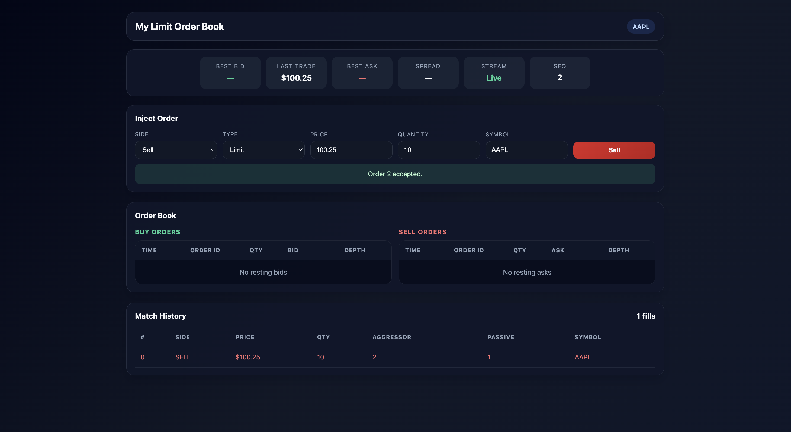

# Limit Order Book Engine

## Tech Stack
### Languages & Compilers


![JavaScript]


### Containers & Release


### Systems & Infra


## Repo Layout
```text
cpp/
  include/order_book/
    book/
        price_level_interface.hpp
        array_price_level.hpp
        linked_list_price_level.hpp
        order_book_interface.hpp
        tree_order_book.hpp
        vector_order_book.hpp
    core/
        event.hpp
        order.hpp
        price_utils.hpp
    engine/
        simulation_config.hpp
        simulation_engine.hpp
    matching/
        fifo_matcher.hpp
        matching_algorithm.hpp
        pro_rata_matcher.hpp
    orders/
        order_validators.hpp
        stop_order_manager.hpp
    sources/
        order_source.hpp
        interactive_source.hpp
        historical_replayer.hpp
        strategy_source.hpp
  src/
    book/
        array_price_level.cpp
        linked_list_price_level.cpp
        tree_order_book.cpp
        vector_order_book.cpp
    engine/
        simulation_engine.cpp
    matching/
        fifo_matcher.cpp
    orders/
        stop_order_manager.cpp
    sources/
        interactive_source.cpp
  tests/
    book/
        test_tree_order_book.cpp
  benchmarks/
```

## Architecture

## Engine API
Supported order types: Market, Market limit, Limit, Stop, Stop Limit, Immediate-or-Cancel (IOC), Fill-or-Kill (FOK) 

## Build, Run, and Visualize


### Docker

Build and run the app with Docker Compose:

```bash
docker compose up --build
```

- Backend: http://localhost:8000
- Frontend: http://localhost:5173


### Run without Docker
1. Install backend dependencies:
   ```bash
   cd python/backend && python3 -m pip install -r requirements.txt
   ```

2. Start the API server from the backend directory:
   ```bash
   cd python/backend && uvicorn app.main:app --reload --host 127.0.0.1 --port 8000
   ```

3. Install frontend dependencies:
   ```bash
   cd frontend && npm install
   ```

4. Start the React dev server:
   ```bash
   cd frontend && npm run dev
   ```


### Unit Tests
63 Google Test tests to validate core engine functionality.

```bash
cmake
ctest --test-dir build
```
